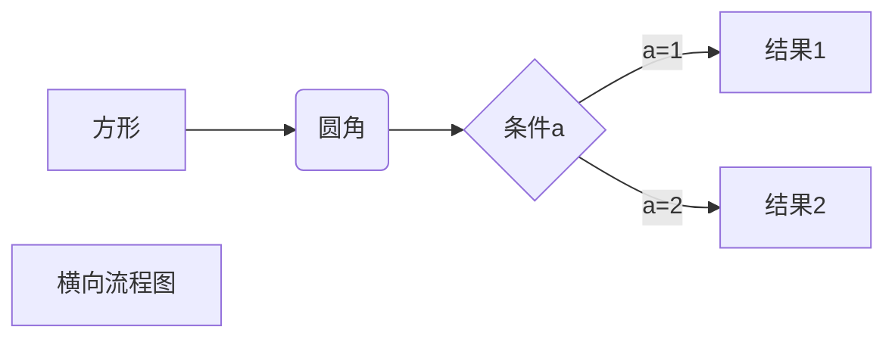
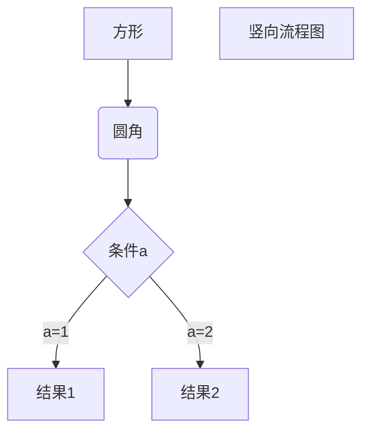
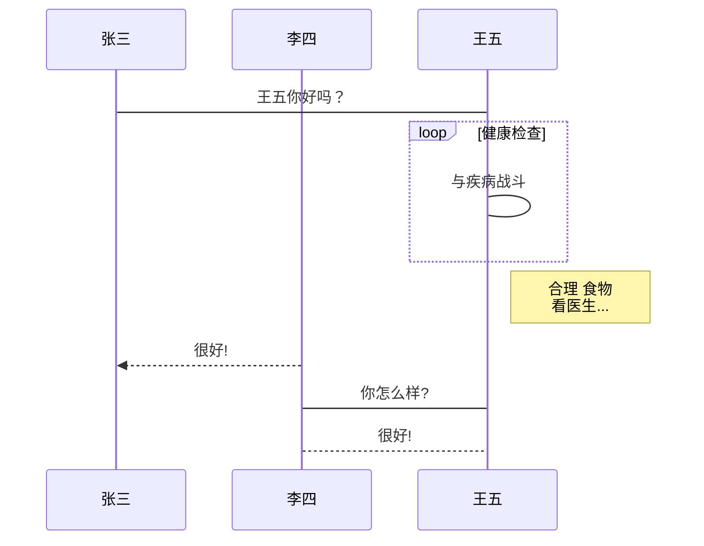
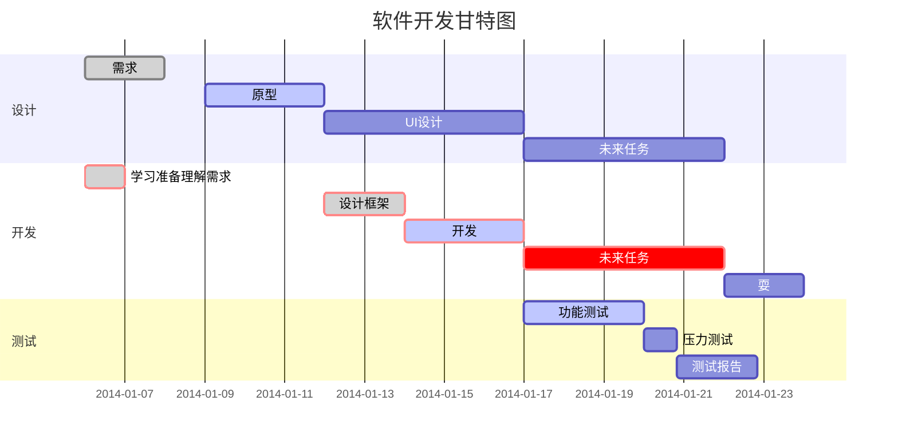

<span id = "index">__目录__</span>

[toc]
# 一、Markdown入门基础编辑用法

## 1、斜体、粗体、粗斜体

```
**粗体**
__星号和下划线一样__  
*单个是斜体*
_单个是斜体_
***斜粗体***
```

<font color=Blue>[效果](#index)：</font>

**粗体**
__星号和下划线一样__  
*单个是斜体*
_单个是斜体_
***斜粗体***

---

## 分割线

```
---
___
***
```

<font color=Blue>[效果](#index)：</font>

---
___
***

## 3、删除线

```
~~我是要删除的文字~~
**~~粗体删除线~~**
*~~斜体删除线~~*
***~~粗体斜体删除线~~***
```

<font color=Blue>[效果](#index)：</font>

~~我是要删除的文字~~
**~~粗体删除线~~**
*~~斜体删除线~~*
***~~粗体斜体删除线~~***

---

## 4、下划线

```
<u>下划线</u>
```

<font color=Blue>[效果](#index)：</font>

<u>下划线</u>

---

## 5、区块引用

```
>区块引用
>>多层引用
```

<font color=Blue>[效果](#index)：</font>

>区块引用
>
>>多层引用

---

## 6、标题样式

```
# Atx一级标题
## Atx二级标题
### Atx三级标题
#### Atx四级标题
#### Atx五级标题
##### Atx六级标题
```

## 7、无序列表

```
- 减号无序列表
- 减号无序列表
+ 加号无语列表
+ 加号无序列表
* 星号无序列表
* 星号无序列表
- - 混合使用
+ + 混合使用
+ * 混合使用
* - 混合使用
```

<font color=Blue>[效果](#index)：</font>

- 减号无序列表
- 减号无序列表
+ 加号无语列表
+ 加号无序列表
* 星号无序列表
* 星号无序列表
- - 混合使用
+ + 混合使用
+ * 混合使用
* - 混合使用

---

## 8、有序列表

```
1. 有序列表1
2. 有序列表2
5. 有序列表5
8. 有序列表8
6. 有序列表6
```

<font color=Blue>[效果](#index)：</font>

1. 有序列表1

2. 有序列表2

3. 有序列表5

4. 有序列表8

5. 有序列表6

---

   ## 9、嵌套列表

```
- 嵌套列表1
  - 嵌套列表2
  - 嵌套列表3
   - 嵌套列表4
     - 嵌套列表5
```

<font color=Blue>[效果](#index)：</font>

- 嵌套列表1
  - 嵌套列表2
  - 嵌套列表3
   - 嵌套列表4
     - 嵌套列表5

---

## 10、链接

### 10.1、行内(inline)形式

```\
[文字描述](网址链接)
[百度](www.baidu.com)
```

<font color=Blue>[效果](#index)：</font>

[百度](www.baidu.com)

### 10.2、加上title属性

```
[文字描述](网址链接 "title属性")
[百度](www.baidu.com "with a title")
```

<font color=Blue>[效果](#index)：</font>

[百度](www.baidu.com "with a title")

### 10.3、参考(reference)方式

```
[文字描述][id]
[id]: 网址链接
```

```
这是[Google][1] ，这是[Yahoo][2]，这是[MSN][3]. 
[1]: http://google.com/ "Google"
[2]: http://search.yahoo.com/ "Yahoo Search" 
[3]: http://search.msn.com/ "MSN Search"
```

<font color=Blue>[效果](#index)：</font>

这是[Google][1] ，这是[Yahoo][2]，这是[MSN][3]. 
[1]: http://google.com/ "Google"
[2]: http://search.yahoo.com/ "Yahoo Search"
[3]: http://search.msn.com/ "MSN Search"

### 10.4、自动链接

```
<https://www.baidu.com>
```

<font color=Blue>[效果](#index)：</font>

<https://www.baidu.com>

---

## 11、插入图片

```

```

<font color=Blue>[效果](#index)：</font>


```
![Furina][id] 
[id]:https://actwebstatic.mihoyo.com/upload/contentweb/hk4e/e8d153da1a2dca7a07fd76397cd60612_7641410511196198159.png
```

<font color=Blue>[效果](#index)：</font>

![Furina][id] 

[id]:https://act-webstatic.mihoyo.com/upload/contentweb/hk4e/e8d153da1a2dca7a07fd76397cd60612_7641410511196198159.png

---

## 12、代码

### 12.1、代码段

```
I strongly recommend against using any `<blink>` tags.
I wish SmartyPants used named entities like `&mdash;`
instead of decimal-encoded entites like `&#8212;`
```

<font color=Blue>[效果](#index)：</font>

I strongly recommend against using any `<blink>` tags.
I wish SmartyPants used named entities like `&mdash;`
instead of decimal-encoded entites like `&#8212;`

### 12.2、行内代码

````
```python
@requires_authorization
def somefunc(param1='', param2=0): '''A docstring'''
if param1 > param2: # interesting print 'Greater'
return (param2 - param1 + 1) or None class SomeClass:
pass
>>> message = '''interpreter
... prompt'''

```
````

<font color=Blue>[效果](#index)：</font>

```python
@requires_authorization
def somefunc(param1='', param2=0): '''A docstring'''
if param1 > param2: # interesting print 'Greater'
return (param2 - param1 + 1) or None class SomeClass:
pass
>>> message = '''interpreter
... prompt'''

```

## 13、注释

```
<!-- 注释 -->
```

## 14、转译字符

```
\\ 反斜杠
\` 反引号
\* 星号
\_ 下划线
\{\} 大括号
\[\] 中括号
\(\) 小括号
\# 井号
\+ 加号
\- 减号
\. 英文句号
\! 感叹号

```

<font color=Blue>[效果](#index)：</font>

\\ 反斜杠
\` 反引号
\* 星号
\_ 下划线
\{\} 大括号
\[\] 中括号
\(\) 小括号
\# 井号
\+ 加号
\- 减号
\. 英文句号
\! 感叹号

## 15、表格

```
|表头1| 表头2 | 表头3|
|----|-------|-----|
|内容1 | 内容2 | 内容3|
|内容1 | 内容2 | 内容3|

```

语法说明如下：

1） 单元格使用|来分隔，为了阅读更清晰，建议最前和最后都使用|。

2） 单元格和|之间的空格会被移除。

3） 表头与其他行使用-来分隔。

4） 表格对齐格式如下

左对齐（默认） :-

右对齐  -:

居中对齐 :-: 

5）块级元素（代码区块、引用区块）不能插入表格中。

关于创建表格的建议如下。

1） 在表格的前、后各空1行。

2） 在每一行最前和最后都使用|，每一行中的|要尽量都对齐。

3） 不要使用庞大复杂的表格，那样会难以维护和阅读。

<font color=Blue>[效果](#index)：</font>

```
普通表格
| 序号 | 标题 | 网址 |
|------|-----|-----|
| 01 | 博客  |https://cnblogs.com |
| 02 | 百度  |https://baidu.com |

对齐表格
| 左对齐 | 居中对齐 | 右对齐 |
| :--- | :----: | ---: |
| 01 | 博客  |https://cnblogs.com |
| 02 | 百度  |https://baidu.com |

表格使用其他标记
| 序号 | 标题 | 网址 |
|-----|------|------|
| **01** | [博客](https://cnblogs.com) |https://cnblogs.com |
| *02* | [百度](https://baidu.com "百度一下，你就知道") |https://baidu.com |
```

普通表格
| 序号 | 标题 | 网址 |
|------|-----|-----|
| 01 | 博客  |https://cnblogs.com |
| 02 | 百度  |https://baidu.com |

对齐表格
| 左对齐 | 居中对齐 |              右对齐 |
| :----- | :------: | ------------------: |
| 01     |   博客   | https://cnblogs.com |
| 02     |   百度   |   https://baidu.com |

表格使用其他标记
| 序号 | 标题 | 网址 |
|-----|------|------|
| **01** | [博客](https://cnblogs.com) |https://cnblogs.com |
| *02* | [百度](https://baidu.com "百度一下，你就知道") |https://baidu.com |

---

---

# 二、Markdown进阶用法

## 1、更改字体、颜色、大小

```
<font face="黑体">我是黑体字</font>
<font face="微软雅黑">我是微软雅黑</font>
<font face="STCAIYUN">我是华文彩云</font>
<font color=red>我是红色</font>
<font color=#008000>我是绿色</font>
<font color=Blue>我是蓝色</font>
<font size=5>我是尺寸</font>
<font face="黑体" color=green size=5>我是黑体，绿色，尺寸为5</font>
```

<font color=Blue>[效果](#index)：</font>

<font face="黑体">我是黑体字</font>
<font face="微软雅黑">我是微软雅黑</font>
<font face="STCAIYUN">我是华文彩云</font>
<font color=red>我是红色</font>
<font color=#008000>我是绿色</font>
<font color=Blue>我是蓝色</font>
<font size=5>我是尺寸</font>
<font face="黑体" color=green size=5>我是黑体，绿色，尺寸为5</font>

## 2、换行

```
<br>
胡<br>桃
```

<font color=Blue>[效果](#index)：</font>

胡<br>桃

---

<span id = "jump">跳转到的位置</span>

<a name="1">第一段</a>

---

## 3、设置图片大小

### 3.1、设置图片百分比

```

```


### 3.2、设置图片大小

```

```


### 3.3、设置图片居中/居左/居右

```
<div align=center></div>
```

<div align=center></div>

```
ps：左→left 中→center 右→right
```

## 4、锚点

网页中，锚点其实就是页内超链接，也就是链接本文档内部的某些元素，实现当前页面中的跳转。

### 方法一：

```
建立一个跳转的连接：
[锚点描述](#锚点名)
标记要跳转到的位置：
<span id = "锚点名">跳转到的位置</span>
```

<font color=Blue>[效果](#index)：</font>

[跳转到设置图片大小上](#jump)

### 方法二：

```
索引：
<a href="#1">第一段</a>
<a href="#2">第二段</a>
<a href="#3">第三段</a>
正文：
<a name="1">第一段</a>
<a name="2">第二段</a>
<a name="3">第三段</a>
```

<font color=Blue>[效果](#index)：</font>

<a href="#1">第一段</a>

## 5、自动创建目录

```
[toc]
```

## 6、图表

### 横向流程图

````


````

<font color=Blue>[效果](#index)：</font>


### 竖向流程图

````

````

<font color=Blue>[效果](#index)：</font>


### 竖向标准流程图

````
```flow
st=>start: 开始框
op=>operation: 处理框
cond=>condition: 判断框(是或否?)
sub1=>subroutine: 子流程
io=>inputoutput: 输入输出框
e=>end: 结束框
st->op->cond
cond(yes)->io->e
cond(no)->sub1(right)->op
```
````
<font color=Blue>[效果](#index)：</font>

```flow
st=>start: 开始框
op=>operation: 处理框
cond=>condition: 判断框(是或否?)
sub1=>subroutine: 子流程
io=>inputoutput: 输入输出框
e=>end: 结束框
st->op->cond
cond(yes)->io->e
cond(no)->sub1(right)->op
```

### 横向标准流程图

````
```flow
st=>start: 开始框
op=>operation: 处理框
cond=>condition: 判断框(是或否?)
sub1=>subroutine: 子流程
io=>inputoutput: 输入输出框
e=>end: 结束框
st(right)->op(right)->cond
cond(yes)->io(bottom)->e
cond(no)->sub1(right)->op
```
````

<font color=Blue>[效果](#index)：</font>

```flow
st=>start: 开始框
op=>operation: 处理框
cond=>condition: 判断框(是或否?)
sub1=>subroutine: 子流程
io=>inputoutput: 输入输出框
e=>end: 结束框
st(right)->op(right)->cond
cond(yes)->io(bottom)->e
cond(no)->sub1(right)->op
```

### UML时序图

````
```sequence
对象A->对象B: 对象B你好吗?（请求）
Note right of 对象B: 对象B的描述
Note left of 对象A: 对象A的描述(提示)
对象B-->对象A: 我很好(响应)
对象A->对象B: 你真的好吗？
```
````

<font color=Blue>[效果](#index)：</font>

```sequence
对象A->对象B: 对象B你好吗?（请求）
Note right of 对象B: 对象B的描述
Note left of 对象A: 对象A的描述(提示)
对象B-->对象A: 我很好(响应)
对象A->对象B: 你真的好吗？
```

### UML时序图源码(复杂)

````
```sequence
Title: 标题：复杂使用
对象A->对象B: 对象B你好吗?（请求）
Note right of 对象B: 对象B的描述
Note left of 对象A: 对象A的描述(提示)
对象B-->对象A: 我很好(响应)
对象B->小三: 你好吗
小三-->>对象A: 对象B找我了
对象A->对象B: 你真的好吗？
Note over 小三,对象B: 我们是朋友
participant C
Note right of C: 没人陪我玩
```

````
<font color=Blue>[效果](#index)：</font>

```sequence
Title: 标题：复杂使用
对象A->对象B: 对象B你好吗?（请求）
Note right of 对象B: 对象B的描述
Note left of 对象A: 对象A的描述(提示)
对象B-->对象A: 我很好(响应)
对象B->小三: 你好吗
小三-->>对象A: 对象B找我了
对象A->对象B: 你真的好吗？
Note over 小三,对象B: 我们是朋友
participant C
Note right of C: 没人陪我玩
```

### UML标准时序图

````


````

<font color=Blue>[效果](#index)：</font>


### 甘特图

````

````

<font color=Blue>[效果](#index)：</font>


### 7、表情

| 语法       | [效果](#index) |
| ---------- | -------------- |
| `:smile:`  | :smile:        |
| `laughing` | :laughing:     |
| `:+1: `    | :+1:           |
| `:-1:`     | :-1:           |
| `:clap: `  | :clap:         |

### 8、高亮

- GFM不支持 
- Typora默认未开启，需要在文件>偏好设置>Markdown>勾选Markdown扩展语法才能支持，请谨慎 使用这几个语法。

| 语法          | <font color=Blue>[效果](#index)：</font> |
| ------------- | ---------------------------------------- |
| `==高亮==`    | ==高亮==                                 |
| `内容^上标^ ` | 内容^上标^                               |
| `内容~下标~ ` | 内容~下标~                               |

### 9、任务列表

任务列表的语法如下：

- 任务列表以-+空格开头，由 [空格/x] 组成。
- x可以小写，也可以大写，有些编辑器可能不支持大写，所以为避免解析错误，推荐使用小写x。
- 当方括号中的字符为空格时，复选框是未选中状态，为x时是选中状态。

```
- []未勾选
- [x]已勾选

今日工作：
- [x] 吃
- [x] 喝
- [ ] 玩
明日计划：
- [ ] 吃
  - [x] 吃鱼
  - [ ] 吃瓜
- [ ] 玩
- [x] 睡
```

<font color=Blue>[效果](#index)：</font>

今日工作：
- [x] 吃
- [x] 喝
- [ ] 玩
明日计划：
- [ ] 吃
  - [x] 吃鱼
  - [ ] 吃瓜
- [ ] 玩
- [x] 睡

### 10、LaTeX公式

- GFM不支持。
-  Typora默认未开启，需要在文件>偏好设置>Markdown>勾选Markdown扩展语法才能支持。

> LaTeX 是一种基于 TeX 的排版系统，由于它易于快速生成复杂表格和数学公式，非常适用于生成 高印刷质量的科技和数学类文档。

#### 10.1、行内公式

```
$数学公式$

分数： $ f(x,y) = \frac{x^2}{y^3} $
开根号： $ f(x,y) = \sqrt[n]{{x^2}{^3}} $
省略号： $ f(x_1, x_2, \ldots, x_n) = x_1 + x_2 + \cdots + x_n $
```

<font color=Blue>[效果](#index)：</font>

分数： $ f(x,y) = \frac{x^2}{y^3} $
开根号： $ f(x,y) = \sqrt[n]{{x^2}{^3}} $
省略号： $ f(x_1, x_2, \ldots, x_n) = x_1 + x_2 + \cdots + x_n $

#### 10.2、块间公式

```
$$
数学公式
$$

$$
\mathbf{V}_1 \times \mathbf{V}_2 = \begin{vmatrix}
\mathbf{i} & \mathbf{j} & \mathbf{k} \\
\frac{\partial X}{\partial u} & \frac{\partial Y}{\partial u} & 0 \\
\frac{\partial X}{\partial v} & \frac{\partial Y}{\partial v} & 0 \\
\end{vmatrix}
{$tep1}{\style{visibility:hidden}{(x+1)(x+1)}}
$$
```

[效果](#index)：
$$
\mathbf{V}_1 \times \mathbf{V}_2 = \begin{vmatrix}
\mathbf{i} & \mathbf{j} & \mathbf{k} \\
\frac{\partial X}{\partial u} & \frac{\partial Y}{\partial u} & 0 \\
\frac{\partial X}{\partial v} & \frac{\partial Y}{\partial v} & 0 \\
\end{vmatrix}
{$tep1}{\style{visibility:hidden}{(x+1)(x+1)}}
$$

# 附录

## LaTeX常见公式表达
### [一](#index)、
| 公式                           | 语法                      |
| ------------------------------ | ------------------------- |
| $\times$                       | \times                    |
| $\div$                         | \div                      |
| $\geq$                         | \geq                      |
| $\leq$                         | \leq                      |
| $x_{a }$                       | _{}                       |
| $x_{a}^{b}$                    | _{}^{}                    |
| ${x_{a}}^{b}$                  | {_{}}^{}                  |
| $\frac{a}{b}$                  | \frac{}{}                 |
| $\to$                          | \to                       |
| $\leftarrow$                   | \leftarrow                |
| $\rightleftharpoons$           | \rightleftharpoons        |
| $\int$                         | \int                      |
| $\int_{a}^{b}$                 | \int_{}^{}                |
| $b\displaystyle\lim_{ x\to 0}$ | \displaystyle\lim_{\to 0} |
| $\sum$                         | \sum                      |
| $\sum_{a}^{b}$                 | \sum_{}^{}                |
| $\sqrt{a}$                     | \sqrt{}                   |
| $\sqrt[b]{a}$                  | \sqrt[]{}                 |
| $\approx$                      | \approx                   |
| $\alpha$                       | \alpha                    |
| $\beta$                        | \beta                     |
| $\xi$                          | \xi                       |
| $\lambda$                      | \lambda                   |
| $\mu$                          | \mu                       |
| $\pi$                          | \pi                       |
| $\phi$                         | \phi                      |
| $\gamma$                       | \gamma                    |
| $\omega$                       | \omega                    |
| $\varphi$                      | \varphi                   |
| $\delta$                       | \delta                    |
| $\partial$                     | \partial                  |
| $\perp$                        | \perp                     |
| $\parallel$                    | \parallel                 |
| $\left|abc\right|$             | `\left| \right|`          |
| $\left ( \right )$             | \left ( \right )          |
| $\infty$                       | \infty                    |
| $\forall$                      | \forall                   |
| $\exists$                      | \exists                   |
| $\subset$                      | \subset                   |
| $\subseteq$                    | \subseteq                 |
| $\subseteqq$                   | \subseteqq                |
| $\nsubseteq$                   | \nsubseteq                |
| $\nsubseteqq$                  | \nsubseteqq               |
| $\supset$                      | \supset                   |
| $\supseteq$                    | \supseteq                 |
| $\supseteqq$                   | \supseteqq                |
| $\nsupseteq$                   | \nsupseteq                |
| $\nsupseteqq$                  | \nsupseteqq               |
| $\angle$                       | \angle                    |
| ${a}'$                         | {}'                       |
| ${a}^{ \left( x+y\right ) }$   | { }^{ \left ( \right ) }  |
| $\bar{a}$                      | \bar{}                    |
| ${90}^{\circ}$                 | { }^{\circ}               |
| $\widehat{abc}$                | \widehat{}                |
| $\overline{abc}$               | \overline{}               |
| $\overrightarrow{abc}$         | \overrightarrow{}         |
| $\overleftarrow{cba}$          | \overleftarrow{}          |
| $\because$                     | \because                  |
| $\therefore$                   | \therefore                |
| $\cdot$                        | \cdot                     |
### [二](#index)、

$$
\begin{cases}
a& \text{ if } x= \\
b& \text{ if } x= \\
c& \text{ if } x=
\end{cases}
$$

```
\begin{cases}
& \text{ if } x= \\
& \text{ if } x= \\
& \text{ if } x=
\end{cases}
```


$$
\begin{matrix}
a&b \\
c&d \\
e&f \\
\end{matrix}
$$

```
$$
\begin{matrix}
& \\
& \\
& \\
\end{matrix}
$$
```

$$
\begin{pmatrix}
a&b \\
c&d \\
e&f \\
\end{pmatrix}
$$

```
\begin{pmatrix}
& \\
& \\
& \\
\end{pmatrix}
```

$$
\begin{vmatrix}
a&b \\
c&d \\
e&f \\
\end{vmatrix}
$$

```
\begin{vmatrix}
& \\
& \\
& \\
\end{vmatrix}
```

$$
\begin{align*}
a&=b \\
c&=d \\
e&=f \\
\end{align*}
$$

```
\begin{align*}
&= \\
&= \\
&= \\
\end{align*}
```

